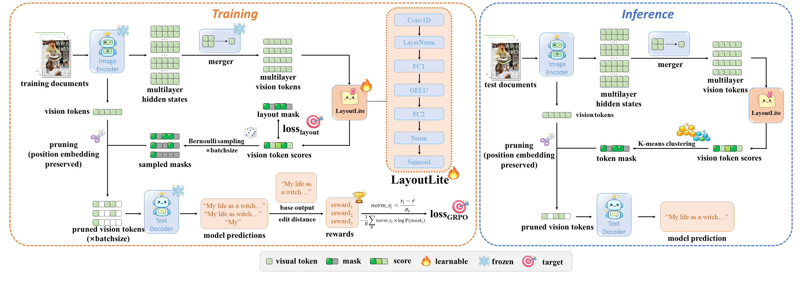

# LayoutLite

> **LayoutLite**: Efficient Visual Token Pruning via Implicit Layout Analysis for End-to-End OCR Models

[](https://arxiv.org/abs/2607.22200)
[]()
[]()
[]()

Official implementation of **LayoutLite**, a lightweight visual token pruning framework for large vision-language OCR models.


## Highlights

- Efficient visual token pruning for high-resolution document OCR
- Implicit layout analysis without requiring external layout detectors
- Preserves OCR accuracy under high compression ratios
- Compatible with modern LVLM-based OCR models
- Plug-and-play design with minimal inference overhead

---

## News

- 2026/7/23 Code released

---

## Introduction

End-to-end OCR systems based on vision-language models have achieved strong performance in complex document understanding, but their efficiency is severely limited by the large number of visual tokens produced from high-resolution document images. Many of these tokens correspond to blank margins or visually redundant regions, yet directly applying generic visual token compression methods may remove OCR-critical fine-grained details. In this paper, we propose LayoutLite, a lightweight plug-and-play module for efficient document OCR. Instead of relying on explicit document layout detection, LayoutLite performs implicit layout analysis at the token level between the vision encoder and the language decoder. It aggregates multi-layer visual representations from the vision encoder, and predicts an importance score for each visual token with a lightweight scoring network. Low-information tokens are then removed before entering the language decoder while preserving the original spatial positional information of retained tokens. To train LayoutLite without human annotations, we cast token selection as a reinforcement learning problem and optimize it with a group-relative policy optimization objective driven by OCR output consistency, together with an auxiliary layout supervision signal to stabilize training. Experiments on OmniDocBench v1.7 demonstrate that LayoutLite can substantially reduce visual token length and inference cost with negligible degradation in recognition quality. We further evaluate LayoutLite on two representative OCR-specialized VLMs, FireRed-OCR and Logics-Parsing-V2. Under up to 50\% token compression, LayoutLite preserves almost the same OmniDocBench v1.7 score on both models while reducing prefill latency, FLOPs, and KV cache memory by over 40\%, with only a small additional inference overhead. These results show that token-level implicit layout analysis is an effective and practical approach for accelerating VLM-based OCR systems.

<p align="center">
  
</p>

---

## Performance

### OmniDocBench

| Method | Compression | Score |
|---------|------------:|------:|
| FireRed-OCR | 0% | 92.753 |
| + LayoutLite | 10% | 92.754 |
| + LayoutLite | 20% | 92.738 |
| + LayoutLite | 30% | 92.388 |
| + LayoutLite | 40% | 92.227 |

More detailed results can be found in our paper.

---

## Installation

Clone the repository.

```bash
git clone https://github.com/dpxudong/LayoutLite.git
cd LayoutLite
```

Create the environment.

```bash
conda create -n layoutlite python=3.10
conda activate layoutlite
```

Install dependencies.

```bash
pip install torch==2.6.0 torchvision==0.21.0 --index-url https://download.pytorch.org/whl/cu118
pip install "https://github.com/Dao-AILab/flash-attention/releases/download/v2.7.3/flash_attn-2.7.3+cu11torch2.6cxx11abiFALSE-cp310-cp310-linux_x86_64.whl"
pip install -r requirements.txt
```

---

## Download Models

Download the required OCR backbone.

```bash
python checkpoints/download_firered.py
python checkpoints/download_logics.py
```

Example:

```
checkpoints/
├── FireRed-OCR/
│   ├── model.safetensors
│   └── ...
├── Logics-Parsing-v2/
│   ├── model-00001-of-00002.safetensors
│   ├── model-00002-of-00002.safetensors
│   └── ...
└── ...
```

---

## Datasets

The benchmark datasets should be organized as follows:

```
datasets/
├── OmniDocBench/
│   └── images/
├── OCRBench_v2/
│   ├── CN_part/
│   └── EN_part/
└── ...
```

Please follow the original dataset licenses when downloading the datasets.

---

<!-- ## Inference

### FireRed-OCR

```bash
python inference_firered.py \
    --model checkpoints/FireRed-OCR \
    --image path/to/image.png
```

### Logics-Parsing-V2

```bash
python inference_logics.py \
    --model checkpoints/Logics-Parsing-v2 \
    --image path/to/image.png
```

--- -->

## Evaluation

Run the evaluation script from the repository root:

```bash
bash scripts/eval.sh
```

The default configuration in `scripts/eval.sh` evaluates LayoutLite with
FireRed-OCR on `datasets/OmniDocBench.jsonl` using 50% token compression:

```bash
python scripts/eval.py \
    --model_type firered \
    --model_dir checkpoints/FireRed-OCR \
    --layoutlite_ckp_path checkpoints/firered_600.pt \
    --dataset datasets/OmniDocBench.jsonl \
    --output_dir ./outputs/test \
    --compression_ratio 0.5
```

To evaluate Logics-Parsing-V2, change `--model_type` to `logics` and set
`--model_dir` and `--layoutlite_ckp_path` to the corresponding model and
LayoutLite checkpoint. The required arguments are:

| Argument | Description |
| --- | --- |
| `--model_type` | OCR model type: `firered` or `logics` |
| `--model_dir` | Directory containing the pretrained OCR model |
| `--layoutlite_ckp_path` | LayoutLite score-head checkpoint (`.pt`) |
| `--dataset` | Evaluation dataset in JSONL format |
| `--output_dir` | Base directory for evaluation outputs |
| `--compression_ratio` | Fraction of visual tokens to prune, e.g. `0.5` |
| `--layoutlite_scores_dir` | Optional directory of precomputed scores; skips LayoutLite score inference |

Each run creates a timestamped `eval_*` directory under `--output_dir`,
including logs, cached scores, and efficiency statistics. The cached scores
are stored in the `cache/scores` subdirectory. You can pass this directory to
`--layoutlite_scores_dir` in a later evaluation to reuse the scores and skip
LayoutLite score inference. For example:

```bash
python scripts/eval.py \
    --model_type firered \
    --model_dir checkpoints/FireRed-OCR \
    --layoutlite_ckp_path checkpoints/firered_600.pt \
    --dataset datasets/OmniDocBench.jsonl \
    --output_dir ./outputs/test_reuse \
    --compression_ratio 0.5 \
    --layoutlite_scores_dir ./outputs/test/eval_<timestamp>/cache/scores
```

---

## Training

Train a LayoutLite score head by first checking the paths in
`scripts/train.sh`, then running:

```bash
bash scripts/train.sh
```

For FireRed-OCR, use the matching model directory and dataset:

```bash
infer_mode=full \
python scripts/train.py \
    --model_type firered \
    --model_dir checkpoints/FireRed-OCR \
    --dataset datasets/OCRBench_FireRed.jsonl \
    --output_dir ./outputs
```

To train with Logics-Parsing-V2, set `--model_type logics`, use
`checkpoints/Logics-Parsing-v2`, and use `datasets/OCRBench_Logics.jsonl`.
The repository's current `scripts/train.sh` is a template: its default
`--model_dir` and `--dataset` should be changed to the paths above before
running it. The training script accepts these additional options:

```text
--batch_size BATCH_SIZE   (default: 5)
--save_step SAVE_STEP     (default: 25)
```

For example:

```bash
infer_mode=full \
python scripts/train.py \
    --model_type firered \
    --model_dir checkpoints/FireRed-OCR \
    --dataset datasets/OCRBench_FireRed.jsonl \
    --output_dir ./outputs \
    --batch_size 5 \
    --save_step 25
```

Each run writes a timestamped `train_*` directory under `--output_dir`.
Checkpoints are saved as `ckp_<step>.pt`; use the desired checkpoint as
`--layoutlite_ckp_path` when running evaluation. The `infer_mode=full`
setting is required by the current training configuration and should be kept
when launching training through the shell.

---

<!-- ## Citation

If you find this project useful, please consider citing:

```bibtex
@article{layoutlite2026,
  title={LayoutLite: Efficient Visual Token Pruning via Implicit Layout Analysis for End-to-End OCR},
  author={Anonymous},
  journal={arXiv preprint},
  year={2026}
}
```

--- -->

## Acknowledgements

LayoutLite is built upon several excellent open-source projects, including:

- Qwen3-VL
- FireRed-OCR
- Logics-Parsing-V2
- OmniDocBench
- OCRBench-v2

We sincerely thank the authors for making their code and datasets publicly available.

---

## License

This project is released under the Apache-2.0 License.


